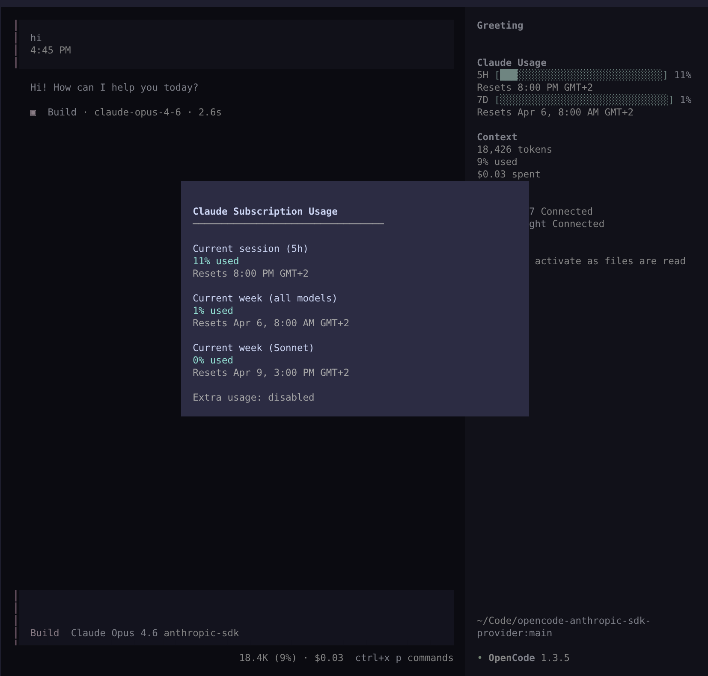

# @xtruder/opencode-claude-max-plugin

An [OpenCode](https://opencode.ai/) plugin that enables Claude Pro/Max subscription access via the official [`@anthropic-ai/sdk`](https://github.com/anthropics/anthropic-sdk-typescript), using OAuth credentials from Claude Code (`~/.claude/.credentials.json`).



## Why?

- **Use your Claude subscription** — Automatically reads OAuth credentials from Claude Code, no separate API key needed
- **Matches Claude Code exactly** — Same headers, billing, tool names, and request format as Claude Code CLI
- **Prompt caching** — 98% of input tokens served from cache (system prompt + tools cached globally)
- **All Claude models** — Opus 4.6, Sonnet 4.6, Haiku 4.5
- **Extended thinking** — Full reasoning support with thinking variants (high/max)
- **Usage tracking** — Sidebar widget with live progress bars + `/usage` command with full details
- **Self-registering** — Models are registered automatically, no manual provider config needed

## Installation

Add the plugin to your `opencode.json` (project-level or `~/.config/opencode/opencode.json` globally):

```json
{
  "$schema": "https://opencode.ai/config.json",
  "plugin": ["@xtruder/opencode-claude-max-plugin"]
}
```

That's it. The plugin self-registers the `anthropic-sdk` provider and its models (Haiku 4.5, Sonnet 4.6, Opus 4.6) at startup via the OpenCode config hook. No separate `provider` block is needed.

Then open OpenCode and run `/connect` → Other → `anthropic-sdk`. If Claude Code is installed and you're logged in, credentials are read automatically from `~/.claude/.credentials.json` — no API key needed.

### TUI Plugin (sidebar + /usage command)

The plugin includes a TUI component that shows subscription usage in the sidebar and registers a `/usage` slash command. To enable it, add the plugin to your `tui.json` as well:

**Project-level** (`.opencode/tui.json`):

```json
{
  "plugin": ["@xtruder/opencode-claude-max-plugin"]
}
```

**Or globally** (`~/.config/opencode/tui.json`):

```json
{
  "plugin": ["@xtruder/opencode-claude-max-plugin"]
}
```

The TUI plugin provides:

- **Sidebar widget** — Compact progress bars for 5-hour session and 7-day weekly usage
- **`/usage` command** — Opens a dialog with full usage breakdown (per-model, extra usage)
- **Auto-refresh** — Polls the usage API every 60s and after each inference call

#### TUI Configuration

Options can be set in the `tui.json` plugin entry:

```json
{
  "plugin": [
    [
      "@xtruder/opencode-claude-max-plugin",
      {
        "enabled": true,
        "sidebar": true,
        "poll_interval": 60
      }
    ]
  ]
}
```

| Option          | Type    | Default | Description                               |
| --------------- | ------- | ------- | ----------------------------------------- |
| `enabled`       | boolean | `true`  | Enable/disable the TUI plugin entirely    |
| `sidebar`       | boolean | `true`  | Show/hide sidebar usage widget            |
| `poll_interval` | number  | `60`    | Seconds between usage API polls (min: 10) |

### Custom model options

If you want to override model settings (e.g. thinking budgets, variants), you can add a `provider` block alongside the plugin:

```json
{
  "$schema": "https://opencode.ai/config.json",
  "plugin": ["@xtruder/opencode-claude-max-plugin"],
  "provider": {
    "anthropic-sdk": {
      "models": {
        "claude-sonnet-4-6": {
          "options": {
            "thinking": { "type": "enabled", "budgetTokens": 1024 }
          },
          "variants": {
            "high": { "thinking": { "type": "enabled", "budgetTokens": 10000 } },
            "max": { "thinking": { "type": "enabled", "budgetTokens": 32000 } }
          }
        }
      }
    }
  }
}
```

Config-level settings are merged with plugin defaults — you only need to specify what you want to override.

## Authentication

Credentials are resolved in order:

1. **`ANTHROPIC_API_KEY` env var** or **`apiKey` provider option**
2. **Claude Code credentials** — auto-read from `~/.claude/.credentials.json`

For Claude Code credentials, log in via `claude` CLI first (`claude auth login`).

## Features

- Streaming and non-streaming completions
- Tool/function calling with Claude Code tool name mapping (`task` → `Agent`, etc.)
- MCP tool name remapping (`server_tool` → `mcp__server__tool`)
- Extended thinking with signature passthrough for multi-turn conversations
- Prompt caching (98% cache hit rate with full OpenCode tool set)
- CCH request signing — computes xxHash64 body integrity hash to unlock features like fast mode
- Subscription rate limit detection — fails fast with clear message instead of hanging
- Long context auto-detection — adds `context-1m` beta header when request body is large
- TUI sidebar with live usage bars + `/usage` slash command with full subscription details

## With Vercel AI SDK

The plugin also works as a standalone Vercel AI SDK provider:

```typescript
import { createAnthropicSDK } from "@xtruder/opencode-claude-max-plugin"
import { streamText } from "ai"

// Uses ~/.claude/.credentials.json automatically
const provider = createAnthropicSDK()
const model = provider.languageModel("claude-sonnet-4-6")

const result = streamText({ model, prompt: "Hello!" })
for await (const chunk of result.textStream) {
  process.stdout.write(chunk)
}
```

## Development

```bash
bun install
bun run build
bun run test    # integration tests (requires ANTHROPIC_API_KEY or Claude Code credentials)
```

See [RESEARCH.md](RESEARCH.md) for detailed reverse-engineering findings on how we matched Claude Code's request format.

## License

MIT
