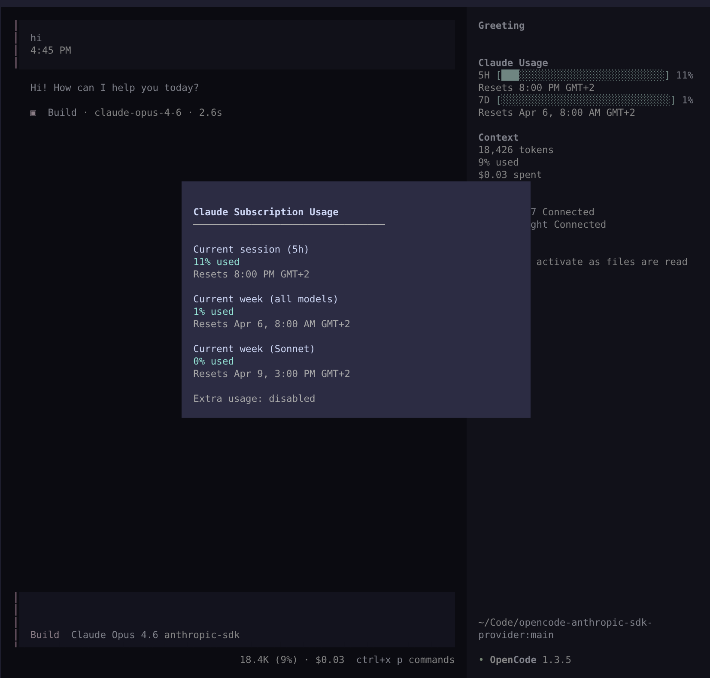

# @xtruder/opencode-claude-max-plugin

An [OpenCode](https://opencode.ai/) plugin that enables Claude Pro/Max subscription access via the official [`@anthropic-ai/sdk`](https://github.com/anthropics/anthropic-sdk-typescript), using OAuth credentials from Claude Code (`~/.claude/.credentials.json`).



## Why?

- **Use your Claude subscription** — Automatically reads OAuth credentials from Claude Code, no separate API key needed
- **Matches Claude Code 2.1.280** — Same request format and behavior as the official CLI
- **Prompt caching** — Multi-turn conversations cache properly, keeping costs and latency low
- **Supported Claude models** — Opus 5.5, Fable 5.1, Opus 5, Sonnet 5, Fable 5, Opus 4.8, Opus 4.7, Opus 4.6, Sonnet 4.6, Haiku 4.5
- **Extended / adaptive thinking** — Full reasoning support across models, including Claude 5 adaptive thinking
- **Safety-refusal fallback** — Current Opus and Fable classifier refusals can fall back in the same request, with TUI notification
- **Usage tracking** — Sidebar widget with live progress bars + `/usage` command
- **Self-registering** — Models are registered automatically, no manual provider config needed

## Installation

Add the plugin to your `opencode.json` (project-level or `~/.config/opencode/opencode.json` globally):

```json
{
  "$schema": "https://opencode.ai/config.json",
  "plugin": ["@xtruder/opencode-claude-max-plugin"]
}
```

That's it. The plugin self-registers the `anthropic-sdk` provider and its models (Haiku 4.5, Sonnet 4.6, Sonnet 5, Opus 4.6, Opus 4.7, Opus 4.8, Opus 5, Opus 5.5, Fable 5, Fable 5.1) at startup via the OpenCode config hook. No separate `provider` block is needed.

Then open OpenCode and models will automatically be available under `anthropic-sdk` provider.

### TUI Plugin (sidebar + /usage command)

The plugin includes a TUI component that shows subscription usage in the sidebar and registers a `/usage` slash command. To enable it, add the plugin to your `tui.json` as well:

**Project-level** (`.opencode/tui.json`):

```json
{
  "plugin": ["@xtruder/opencode-claude-max-plugin"]
}
```

**Or globally** (`~/.config/opencode/tui.json`):

```json
{
  "plugin": ["@xtruder/opencode-claude-max-plugin"]
}
```

The TUI plugin provides:

- **Sidebar widget** — Compact progress bars for 5-hour session and 7-day weekly usage
- **`/usage` command** — Opens a dialog with full usage breakdown (per-model, extra usage)
- **Auto-refresh** — Polls the usage API every 60s and after each inference call
- **Fallback indicator** — Toast when a classifier refusal falls back, plus a sidebar line showing which model served the latest turn

#### TUI Configuration

Options can be set in the `tui.json` plugin entry:

```json
{
  "plugin": [
    [
      "@xtruder/opencode-claude-max-plugin",
      {
        "enabled": true,
        "sidebar": true,
        "poll_interval": 60
      }
    ]
  ]
}
```

| Option          | Type    | Default | Description                               |
| --------------- | ------- | ------- | ----------------------------------------- |
| `enabled`       | boolean | `true`  | Enable/disable the TUI plugin entirely    |
| `sidebar`       | boolean | `true`  | Show/hide sidebar usage widget            |
| `poll_interval` | number  | `60`    | Seconds between usage API polls (min: 10) |

### Custom model options

If you want to override model settings (e.g. thinking budgets, variants), you can add a `provider` block alongside the plugin:

```json
{
  "$schema": "https://opencode.ai/config.json",
  "plugin": ["@xtruder/opencode-claude-max-plugin"],
  "provider": {
    "anthropic-sdk": {
      "models": {
        "claude-sonnet-4-6": {
          "options": {
            "thinking": { "type": "enabled", "budgetTokens": 1024 }
          },
          "variants": {
            "high": { "thinking": { "type": "enabled", "budgetTokens": 10000 } },
            "max": { "thinking": { "type": "enabled", "budgetTokens": 32000 } }
          }
        }
      }
    }
  }
}
```

Config-level settings are merged with plugin defaults — you only need to specify what you want to override.

### Claude Fable and safety-refusal fallback

Claude Fable 5 (`claude-fable-5`) ships with stricter safety classifiers that can refuse a request at the API level (`stop_reason: "refusal"`) — even for benign follow-ups if the conversation contains a flagged topic. To keep sessions usable, the plugin enables Anthropic's server-side fallback by default: when Fable 5 refuses, **Opus 4.8 answers the same request in the same round trip**. Tool loops keep running, thinking chains stay verified, and prompt caching is unaffected.

When a fallback happens:

- The TUI shows a toast (`fable-5 refused — answered by opus-4-8`) on the first fallback turn
- The sidebar shows a `Model Fallback` line while the latest turn was served by the fallback model
- The served model is recorded in part metadata (`anthropic.servedBy`) — the model's own self-report will still say `claude-fable-5`, since identity comes from the prompt, not the serving model

Configure via the `refusalFallback` model option:

```json
{
  "provider": {
    "anthropic-sdk": {
      "models": {
        "claude-fable-5": {
          "options": {
            "refusalFallback": false
          }
        }
      }
    }
  }
}
```

Set it to another model ID to change the fallback target, or `false` to disable (refusals then surface as errors with the refusal category).

Claude Opus 5 also has safety classifiers. Its `refusalFallback` defaults to `"default"`, which lets Anthropic select the recommended fallback for each refusal category. Override or disable it through the same model option on `claude-opus-5`.

Claude Opus 5.5 and Claude Fable 5.1 also default to Anthropic's category-aware fallback. Override or disable it through the same model option on `claude-opus-5-5` or `claude-fable-5-1`.

## Authentication

Credentials are resolved in order:

1. **`ANTHROPIC_API_KEY` env var** or **`apiKey` provider option**
2. **Claude Code credentials** — auto-read from `~/.claude/.credentials.json`

For Claude Code credentials, log in via `claude` CLI first (`claude auth login`).

## Features

- Streaming and non-streaming completions
- Tool/function calling with Claude Code tool name mapping (`task` → `Agent`, `webfetch` → `WebFetch`, etc.)
- MCP tool name remapping (`server_tool` → `mcp__server__tool`)
- Extended thinking (Sonnet/Opus 4.6) and adaptive thinking (Opus 4.7+, Sonnet 5) with effort levels and multi-turn signature passthrough
- Prompt caching that holds across long, tool-heavy conversations
- Server-side safety-refusal fallback for current Opus and Fable models (configurable, on by default)
- Subscription rate limit detection — fails fast with a clear message instead of hanging
- Long-context auto-detection for large prompts
- TUI sidebar with live usage bars + `/usage` slash command

## With Vercel AI SDK

The plugin also works as a standalone Vercel AI SDK provider:

```typescript
import { CLAUDE_CODE_SYSTEM_PROMPT, createAnthropicSDK } from "@xtruder/opencode-claude-max-plugin"
import { streamText } from "ai"

// Uses ~/.claude/.credentials.json automatically
const provider = createAnthropicSDK()
const model = provider.languageModel("claude-sonnet-4-6")

const result = streamText({
  model,
  system: CLAUDE_CODE_SYSTEM_PROMPT,
  prompt: "Hello!",
})
for await (const chunk of result.textStream) {
  process.stdout.write(chunk)
}
```

When using Claude Code OAuth credentials outside OpenCode, you must pass a Claude-compatible system prompt yourself. Exported `CLAUDE_CODE_SYSTEM_PROMPT` is the prompt used by the OpenCode plugin hook.

## Development

```bash
bun install
bun run build
bun test src/*.test.ts    # unit + integration tests (model tests require ANTHROPIC_API_KEY or Claude Code credentials)
```

See [RESEARCH.md](RESEARCH.md) for detailed reverse-engineering findings on how we matched Claude Code's request format.

## License

MIT
